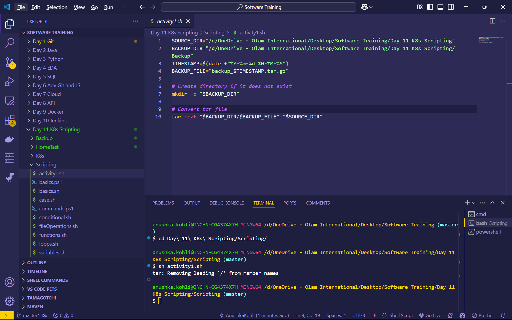
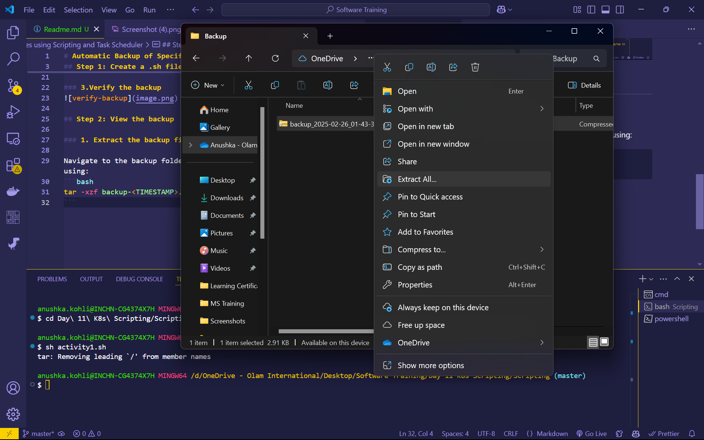
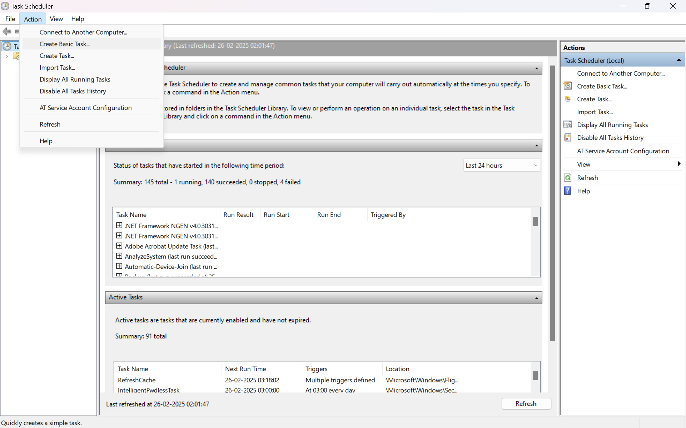
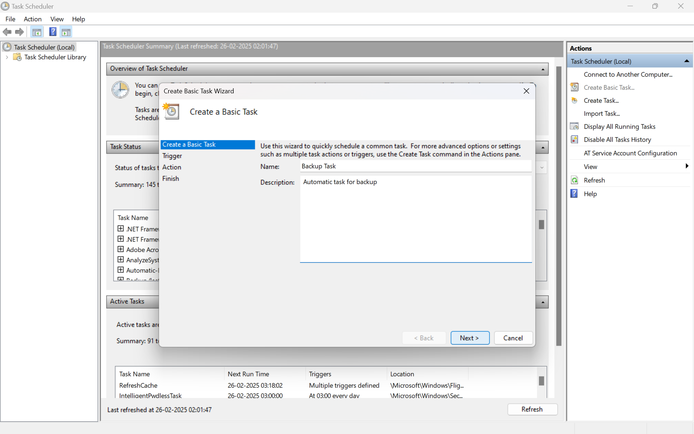
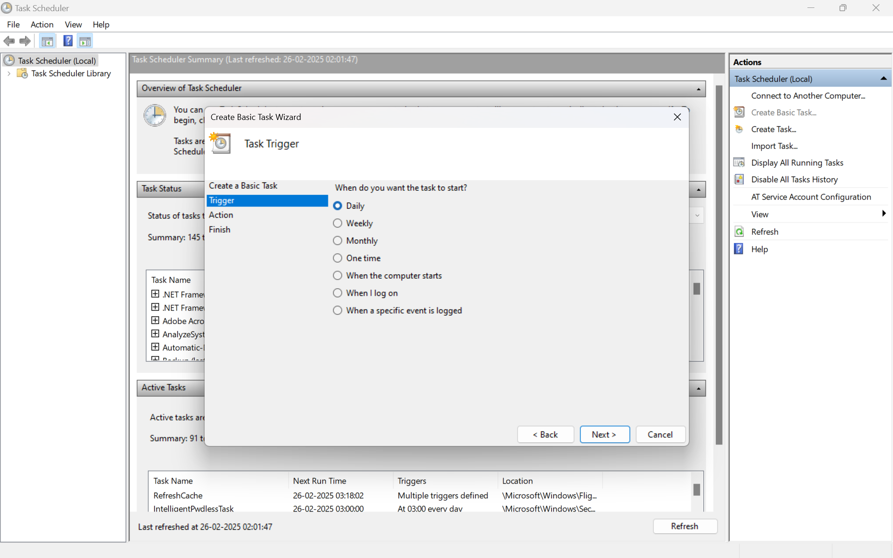
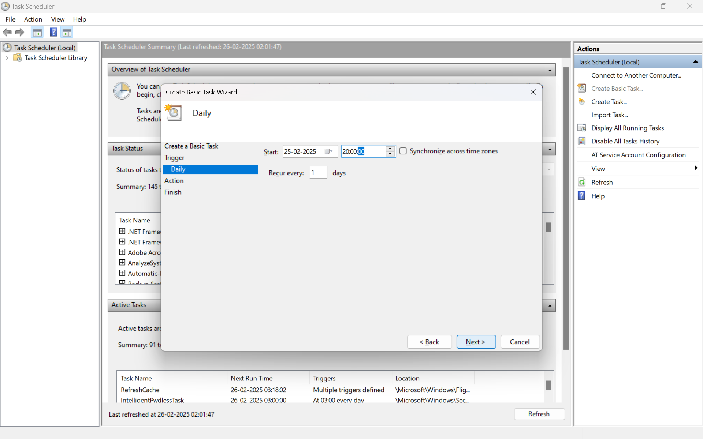
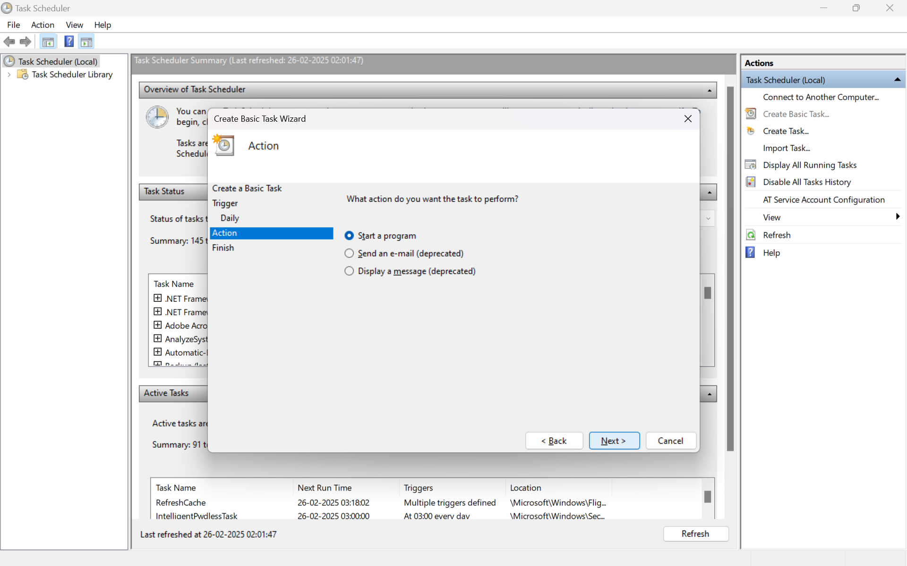
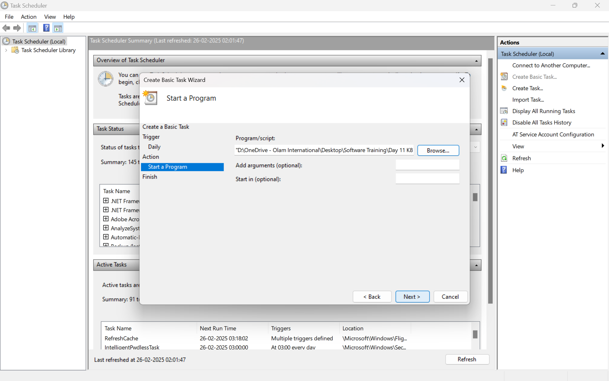
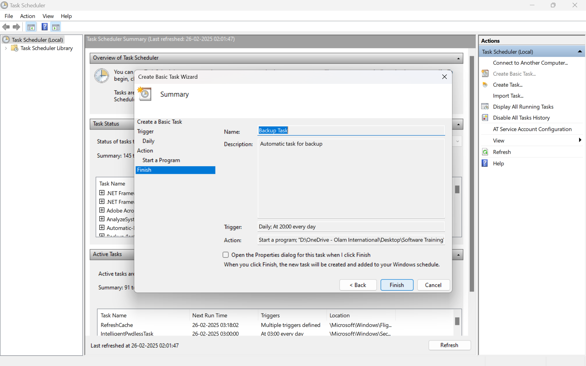

# Automatic Backup of Specific Files using Scripting and Task Scheduler

## Step 1: Create a .sh file with the following script

### 1. Add the following script
    SOURCE_DIR="/d/OneDrive - Olam International/Desktop/Software Training/Day 11 K8s Scripting"
    BACKUP_DIR="/d/OneDrive - Olam International/Desktop/Software Training/Day 11 K8s Scripting/Backup"
    TIMESTAMP=$(date +"%Y-%m-%d_%H-%M-%S")
    BACKUP_FILE="backup_$TIMESTAMP.tar.gz"

    # Create directory if it does not exist
    mkdir -p "$BACKUP_DIR"

    # Convert tar file
    tar -czf "$BACKUP_DIR/$BACKUP_FILE" "$SOURCE_DIR"

### 2. Run the shell script:
```bash
sh activity1.sh
```

### 3.Verify the backup


## Step 2: View the backup

### 1. Extract the backup file:

Navigate to the backup folder and extract the `.tar.gz` file using:
```bash
tar -xzf backup-<TIMESTAMP>.tar.gz
```



## Step 3: Automate the Backup Using Task Scheduler

### 1. Open Task Scheduler and Create a Basic Task


### 2. Add the basic description


### 3. Select how frequently to run the script




### 4. Select the script you want to run




### 5. Review your settings and click 'Finish'
